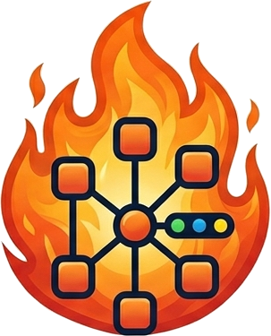

# 🔥 ServersOnFire

**A visual, NetBox-driven dashboard for your homelab or infra fleet.**

ServersOnFire turns your [NetBox](https://netboxlabs.com/) inventory into a
live dashboard: every device and VM tagged for display, its services, their
health, and how it all fits together — in a card grid, a network-style
topology map, or a flat service launcher.

NetBox stays the single source of truth. This app only reads it — it never
invents or stores its own copy of your inventory.

<p align="center">
  
</p>

## Features

- **Cards view** — every tagged device/VM as a card: status, role, site,
  tags, parameters, backup config, and its services with live health dots.
- **Topology view** — a network-map layout: physical hosts in a backbone
  row, their VMs nested below (matched via NetBox's Cluster field), each
  server's services fanned out underneath with one-click LAN/external
  links. Pans, zooms, and re-fits itself to whatever you've filtered down to.
- **Services view** — a flat icon-grid launcher (homer/homarr style) across
  every server, with a single-column layout on mobile.
- **Live health checks** — each service with a URL gets probed on refresh;
  status shows up everywhere (cards, topology, service tiles) as a color.
- **Filterable, shareable** — search, filter by kind/site/status, sort, and
  the whole view state lives in the URL, so a filtered link can be
  bookmarked or shared as-is.
- **Quick links** — a small row of external links (other dashboards, tools,
  whatever you jump to often) that live outside NetBox entirely, editable
  right from the UI or by hand-editing a JSON file.
- **Built-in NetBox cheatsheet** — a collapsible panel explaining exactly
  which tags and custom fields a device/VM needs for any of the above to
  show up, generated from the actual backend logic rather than a doc that
  drifts out of sync with it.

## How it works

Only devices/VMs carrying a specific NetBox tag (`netmap` by default,
configurable via `DISPLAY_TAG`) are shown — everything else in your NetBox
instance is ignored. A device or VM's services come from NetBox's IPAM
**Service** objects assigned to it, with two custom fields (`internal_url`,
`external_url`) driving the health check and the open-service buttons.

Open the app and expand the "How do I get something to show up here?"
panel at the bottom of the page for the full, always-current field-by-field
reference.

## Tech stack

FastAPI backend, React + TypeScript + Vite + Mantine v9 frontend,
[`@xyflow/react`](https://reactflow.dev/) for the topology view, single
Docker image (frontend built and served as static files by the backend).

## Local dev

Backend:
```
cd backend
uv venv .venv && uv pip install --python .venv/bin/python -e ".[dev]"
cp ../.env.example ../.env   # fill in NETBOX_URL / NETBOX_TOKEN
export $(grep -v '^#' ../.env | xargs)
.venv/bin/uvicorn app.main:app --reload
```

Frontend (separate terminal):
```
cd frontend
npm install
npm run dev
```
Vite proxies `/api/*` to `http://127.0.0.1:8000` (see `vite.config.ts`).

## Tests

`backend/app/dataset.py` is a pure transform (no I/O) — tested against
frozen fixtures, no live NetBox connection needed:
```
cd backend && .venv/bin/pytest -q
```

## Deploying

```
cp .env.example .env   # fill in your real NETBOX_URL / NETBOX_TOKEN
docker compose up -d --build
```
`--build` matters — skipping it serves a stale image with an old frontend
bundle. Quick links (`data/quicklinks.json`) live in a bind-mounted `data/`
directory so they survive rebuilds; see `.env.example` for every other
configurable option (login gate, refresh interval, display tag, etc).

Default port is **8092** — change the left side of the `ports:` mapping in
`docker-compose.yml` if that's taken on your host.
